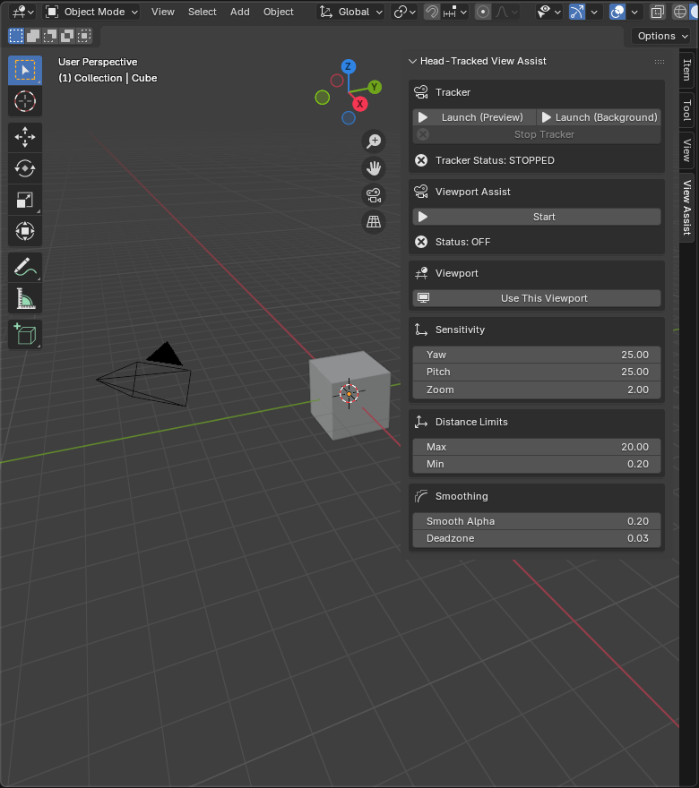

# Head-Tracked View Assist (Blender Add-on)

Head-Tracked View Assist is a Blender add-on that enables hands-free viewport navigation using real-time head tracking from a standard webcam.

### Demo

### UI

It combines:
- a Blender add-on (UI + viewport control), and
- a bundled tracker executable (OpenCV + MediaPipe) that sends motion data to Blender over localhost UDP.

## Features
- Real-time head tracking using a webcam  
- Smooth viewport yaw/pitch + zoom  
- Adjustable sensitivity and smoothing  
- Multi-viewport support  
- One-click tracker launch from Blender  
- Launch tracker with preview window or run silently in the background  
- Prevents multiple tracker instances from running simultaneously  
- No external Python installation required  

## Requirements
- Blender 4.x (Windows)
- Windows 10/11
- Webcam

## Download / Install
1. Go to **Releases** and download the latest ZIP asset (e.g. `head_tracked_view_assist_v0.1.0.zip`).
2. In Blender: **Edit → Preferences → Add-ons → Install…**
3. Select the downloaded ZIP.
4. Enable the add-on.
5. Open the 3D View sidebar (**N**) → **View Assist** tab.

## Usage
1. Click **Launch Tracker** (allow webcam access if prompted).
2. Click **Start** to enable head-tracked view assist.
3. Move your head to control the viewport.
4. Use **Stop Tracker** to close the tracker gracefully.

## Tracker Launch Modes

The tracker can be launched in two ways:

**Preview Mode**
- Opens a window showing the webcam feed
- Useful for setup and calibration
- Allows visual confirmation that tracking is working

**Background Mode**
- Runs silently without any visible window
- Ideal for normal use while working in Blender
- Reduces screen clutter and system distraction

Only one tracker instance can run at a time.

### Controls
| Motion | Effect |
|---|---|
| Head left/right | Yaw rotation |
| Head up/down | Pitch rotation |
| Move closer/farther | Zoom |

## How it works
**Data flow:**
Webcam → OpenCV → MediaPipe → Motion Extraction → UDP → Blender → Viewport Update

**Localhost ports:**
- Pose data: `127.0.0.1:5005`
- Control channel: `127.0.0.1:5006`

No external network access is required.

## Files created at runtime
- `config.json`: stores persistent tracker settings (ex: camera index)
- `tracker_pid.txt`: used for safe shutdown / process management

## Privacy & Security
- Webcam data is processed locally only
- No images are stored or transmitted externally
- UDP communication is limited to localhost

## Troubleshooting
**Tracker does not start**
- Ensure antivirus allows webcam access
- Verify the webcam is not used by another application

**Port already in use**
- You may have multiple tracker instances running
- Stop the existing tracker before launching again, or restart Blender

**No face detected**
- Improve lighting
- Ensure face is visible to camera
- Verify the correct camera is selected

**Preview window shows wrong camera or black screen**
- Your system may have multiple camera devices (built-in webcam, USB webcam, virtual cameras, etc.)
- The tracker may open a different device than expected
- In the Preview window, press:

  - **N** → Next camera device  
  - **P** → Previous camera device  

- Cycle until the correct webcam feed appears
- The selected camera is saved for future launches

## ⚠ Known Issues (v0.1.4)

• Linux: Tracker window may appear black, but tracking functions normally.

• macOS (Intel & Apple Silicon): Tracker does not auto-launch from Blender menu.  Workaround: Manually run the tracker executable inside the add-on folder using terminal.

Fixes are planned for v0.1.5.

## License

This project is licensed under the MIT License.  
See the LICENSE file for details.
